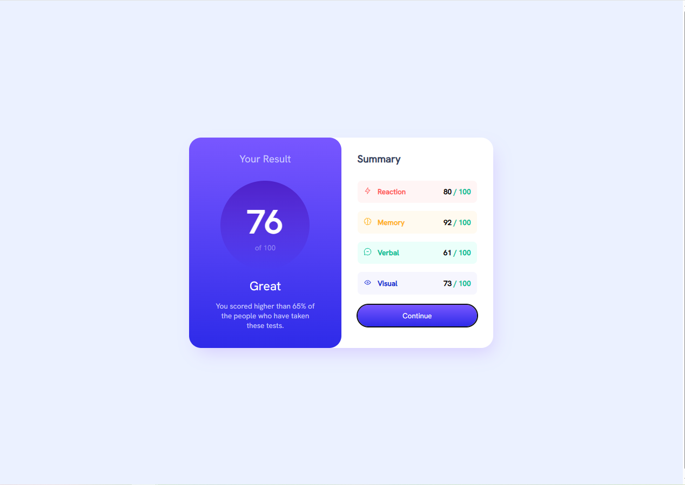
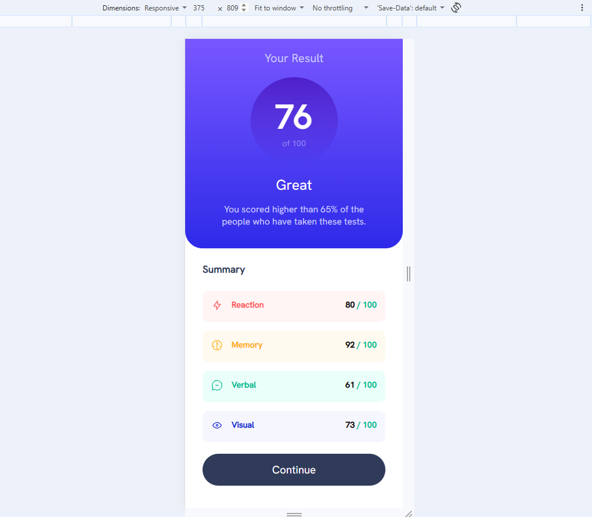

# Frontend Mentor - Results summary component solution

This is a solution to the [Results summary component challenge on Frontend Mentor](https://www.frontendmentor.io/challenges/results-summary-component-CE_K6s0maV). Frontend Mentor challenges help you improve your coding skills by building realistic projects. 

## Table of contents

- [Overview](#overview)
  - [The challenge](#the-challenge)
  - [Screenshot](#screenshot)
- [My process](#my-process)
  - [Built with](#built-with)
  - [What I learned](#what-i-learned)
  - [Continued development](#continued-development)
  - [Useful resources](#useful-resources)
- [Author](#author)
- [Acknowledgments](#acknowledgments)

## Overview

### The challenge

Users should be able to:

- View the optimal layout for the interface depending on their device's screen size
- See hover and focus states for all interactive elements on the page

### Screenshot

## My process

### Built with

- Semantic HTML5 markup
- CSS custom properties
- Flexbox
- Mobile-first workflow

### What I learned

I could practise how I can use HTML and CSS to project webpage. The information from IT course I tested. In this particular project I found out in what way I can make the color's gradient of the background and the methods of creating respositive pages. Moreover, I rebuilt this project based of suggestions from report of my previous project (https://www.frontendmentor.io/challenges/order-summary-component-QlPmajDUj):
- the 'outline:none' was removed from focus states
- margins with minuses was deleted
- the width of main was changed to percent, the box sizing was added, the additional divs were added into parameters class; all these things improved the respositiveness

### Continued development

I will be trying to use the semantic tags during whole creating future projects process. For this one I had to rebuild the project after creating it only on divs.
Additionaly, I will be trying use divs with 'display:flex' instead margins to improve resposiveness in next projects.

### Useful resources

- https://miroslawzelent.pl/kurs-html/
- https://miroslawzelent.pl/kurs-css/
- https://digitalportal.pl/box-shadow-generator - It helped in showing previews of some shadows settings
- https://kurshtmlcss.pl/kurs-css/gradient/ - I learned how I can use gradients

## Author

- github - [Łukasz Nowak](https://github.com/lukasz-nowak44)

## Acknowledgments

Thanks for Artur and team from https://projekt.przyszlyprogramista.pl/
